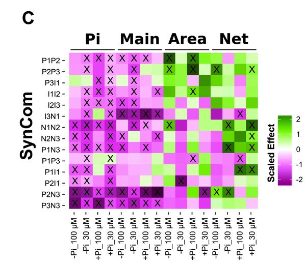

This document was created for the workshop **Data Management for Publishing:
Accessibility and Reproducibility**, to be taught on April 23rd, 2022. All
resources for the Rmarkdown session of the workshop, plus some additional
ones, can be found in the GitHub repository
[surh/Rmarkdown_wheelP](https://github.com/surh/Rmarkdown_wheelP).

The data and code in this document reproduce some of the analysis from
@HerreraParedes2018. The full data and code from that publication can be found
in the GitHub repository [surh/wheelP](https://github.com/surh/wheelP).

# Setup

The first step is to load the packages and data that we need for analysis.
We will use the [tidyverse](https://www.tidyverse.org/) collection of packages

```{r}
library(tidyverse)
```

Now, we read the data which is in the `data` directory of the GitHub repository
of the workshop, and we can print the first few rows.
```{r read data}
Dat <- read_tsv("data/phenotypes.tsv",
                col_types = cols(Pi_content = col_number(),
                                 Elongation = col_number(),
                                 Experiment = col_character(),
                                 EndP = col_character(),
                                 Bacteria = col_character(),
                                 Plate = col_character()))
Dat
```

This dataset contains `r nrow(Dat)` observations. The observations correspond to
a subset of the observations published by @HerreraParedes2018. Specifically,
the dataset indicates the shoot phosphate (Pi) content ($\frac{Pi\ mmol }{FW\ mg}$),
and main root elongation (cm) measurements of *Arabidopsis thaliana* plants that
were germinated in the absence of Pi, and then received concurrent treatments
of one of two levels of Pi ($30 \mu M$, $100 \mu M$), and one of three bacterial
cocktails (P1P2, I1I2, N2N3) or no bacteria (axenic).

# Sanity checks

```{r pheno cors}
Dat %>%
  ggplot(aes(x = Pi_content, y = Elongation, col = EndP)) +
  geom_point() +
  geom_smooth(method = "lm", formula = y ~ x) +
  theme_classic()
```

```{r}
Dat %>%
  arrange(Elongation)
```

```{r}
Dat <- Dat %>%
  filter(Elongation > 2)
```

Now we have `r nrow(Dat)` observations in the dataset.

```{r}
Dat %>%
  ggplot(aes(x = Pi_content, y = Elongation, col = EndP)) +
  geom_point() +
  geom_smooth(method = "lm", formula = y ~ x) +
  theme_classic()
```

## What is the effect of shoot Pi content on main root elongation?

```{r}
f1 <- Elongation ~ Pi_content + Bacteria + Experiment
m1 <- lm(f1, data = Dat %>% filter(Elongation > 2))
summary(m1)
```
```{r, echo = FALSE, results = "asis"}
knitr::kable(summary(m1)$coefficients,
             caption = paste("Coefficients of linear model (",
                             format(f1), ").",
                             "We observe that shoot Pi content has no significant",
                             "effect on main root elongation."))
```

# Recreating figure 3C



[test single community](https://github.com/surh/wheelP/blob/master/R/test_single_community_phenotype.r)

```{r, echo = FALSE}
test_phenotype <- function(Dat, phenotype){
  f1 <- paste(phenotype, "~", "Bacteria + Experiment")
  f1 <- as.formula(f1)
  
  m1 <- lm(f1, data = Dat)
  Res <- summary(m1)$coefficients
  
  Res <- as.data.frame(Res)
  Res$var <- row.names(Res)
  row.names(Res) <- NULL
  Res <- Res %>%
    filter(var %in% c("BacteriaI1I2", "BacteriaN2N3", "BacteriaP1P2" )) %>%
    mutate(phenotype = phenotype) %>%
    rename(se = "Std. Error",
           t.value = "t value",
           p.value = "Pr(>|t|)")
  
  return(Res)
}
```

## Bacteria effect on shoot Pi content

```{r}
Pi_res <- bind_rows(test_phenotype(Dat = Dat %>%
                                     filter(EndP == "30 uM,0%Suc"),
                                   phenotype = "Pi_content") %>%
                      mutate(EndP = "30 uM"),
                    test_phenotype(Dat = Dat %>%
                                     filter(EndP == "100 uM,0%Suc"),
                                   phenotype = "Pi_content") %>%
                      mutate(EndP = "100 uM"))
Pi_res
```


## Bacteria effect on main root elongation

```{r}
Elo_res <- bind_rows(test_phenotype(Dat = Dat %>%
                                      filter(EndP == "30 uM,0%Suc"),
                                    phenotype = "Elongation") %>%
                       mutate(EndP = "30 uM"),
                     test_phenotype(Dat = Dat %>%
                                      filter(EndP == "100 uM,0%Suc"),
                                    phenotype = "Elongation") %>%
                       mutate(EndP = "100 uM"))
Elo_res
```

## Combine the results

```{r}
Res <- bind_rows(Pi_res, Elo_res) %>%
  mutate(SynCom = str_remove(var, "^Bacteria")) %>%
  select(-var)
Res
```

```{r, out.width="50%", fig.show='hold', fig.cap="**Left**: Estimates of bacterial effect on two plant phenotypes. **Right**: Similar estimates from @HerreraParedes2018."}
Res %>%
  mutate(significant = c("", "X")[ (p.value < 0.05) + 1 ]) %>%
  mutate(SynCom = factor(SynCom,levels = rev(c("P1P2", "I1I2", "N2N3"))),
         phenotye = factor(phenotype, levels = c("Pi_content", "Elongation"))) %>%
  ggplot(aes(x = EndP, y = SynCom)) +
  facet_wrap(~phenotype) +
  geom_tile(aes(fill = t.value)) +
  geom_text(aes(label = significant), size = 12) +
  scale_fill_gradient2(low = "magenta", mid = "white", high = "green",
                       midpoint = 0) +
  guides(fill = guide_legend(title = "Scaled Effect", title.position = "left")) +
  theme(panel.background = element_blank(),
        axis.text = element_text(color = "black"),
        axis.title.y = element_text(face = "bold"),
        axis.title.x = element_blank(),
        axis.text.x = element_text(angle = 90, vjust = 0.5),
        legend.title = element_text(face = "bold", angle = 90),
        strip.background = element_blank(),
        strip.text = element_text(color = "black", face = "bold", size = 20))

```

# Session Info

```{r}
sessionInfo
```


# References


